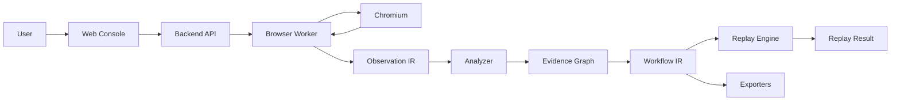

# System Overview

## Architecture Goal

The architecture should support a local-first recording and replay loop while leaving room for later analysis, export, and agent-assisted workflows.

P0 should stay simple enough to build:

- one web console
- one backend API
- one browser worker
- one shared schema layer
- local storage

## Technology Baseline

Step 00 established a TypeScript-first local runtime baseline:

- Monorepo: pnpm workspace with Turborepo task orchestration.
- Web Console: React, Vite, and TypeScript.
- Backend API: Fastify and TypeScript.
- Browser Worker: Playwright and TypeScript.
- Shared schemas: TypeBox / JSON Schema compatible schema definitions.
- Package boundaries: `apps/*` for runtimes and `packages/*` for shared contracts.

This keeps the first local loop in one language while the IR contracts are still changing. Future Go or Python services can be added behind JSON Schema or Workflow IR boundaries when the runtime need is clear.

## Runtime Components

### Web Console

User interface for:

- starting and stopping recording sessions
- viewing captured timelines
- inspecting browser and network events
- reviewing generated links and workflows
- launching replay

### Backend API

Application service for:

- recording session management
- event ingestion
- event querying
- workflow generation requests
- replay requests
- persistence coordination

### Browser Worker

Runtime process for:

- launching Chromium
- driving Playwright
- capturing browser actions
- capturing network events
- sending events to Backend API or local storage

### Network Capture

Capture layer for:

- request metadata
- response metadata
- request body references
- response body references
- request timing
- GraphQL detection

P0 can start with Playwright and CDP-based capture. mitmproxy can be introduced later when lower-level or proxy-level evidence is required.

### Analyzer

Analysis layer for:

- static asset filtering
- endpoint grouping
- action-request linking
- field dependency detection
- evidence graph generation
- confidence scoring

### Replay Engine

Execution layer for:

- running Workflow IR
- resolving variables
- sending HTTP requests
- extracting response values
- checking assertions
- recording replay result evidence

### Exporters

Conversion layer for:

- OpenAPI
- Arazzo
- Postman
- custom DSL
- generated code

Exporters are not required in Step 00.

## Core Data Flow

```text
User Action
-> Browser Worker
-> Browser Event
-> Network Event
-> Backend API
-> Observation IR
-> Analyzer
-> Evidence Graph
-> Workflow Generator
-> Workflow IR
-> Replay Engine
-> Replay Result
-> Exporter
```

## Mermaid Overview



## P0 Storage Model

P0 should use a simple local persistence strategy:

- SQLite for recording session metadata, event indexes, evidence links, workflow records, and replay result records.
- Filesystem artifacts for large bodies, screenshots, DOM snapshots, traces, and other payloads referenced by `artifact://...` URIs.

Step 00 does not implement persistence. Step 01 should start turning Observation IR into validated and locally persisted events.

Minimum entities:

- recording session
- observation event
- artifact reference
- evidence link
- workflow
- replay result

## P0 Architecture Constraints

- Keep runtime local.
- Avoid multi-tenant permissions in P0.
- Avoid distributed worker orchestration in P0.
- Keep all generated analysis traceable to raw observations.
- Make replay part of the core loop, not a later add-on.

## Future Architecture Extensions

- mitmproxy-based capture
- distributed browser workers
- project-level collaboration
- workflow versioning
- secret management
- standard export pipelines
- LLM-assisted explanation and repair
